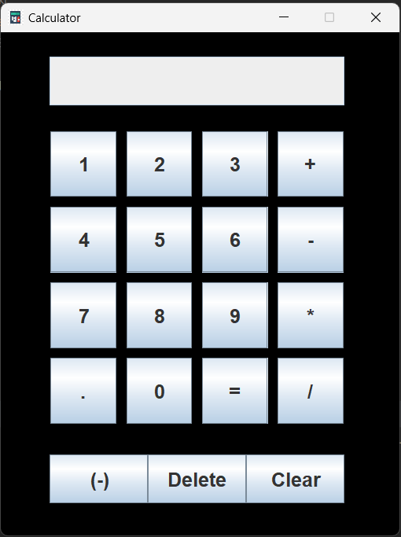
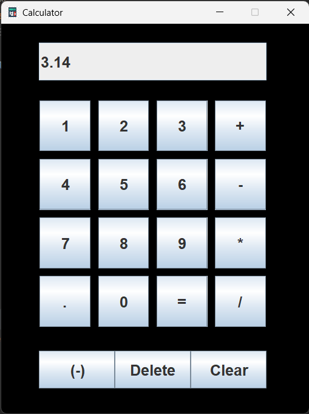

# Calculator Desktop App

This is one of my first projects when I stared learning Java. Using the calculator you can do addition, subtraction, 
multiplication and division. Both positive and negative numbers can be used. It is made using external help. Below you 
can see screenshots of the app.

### Screenshot 1

### Screenshot 2

